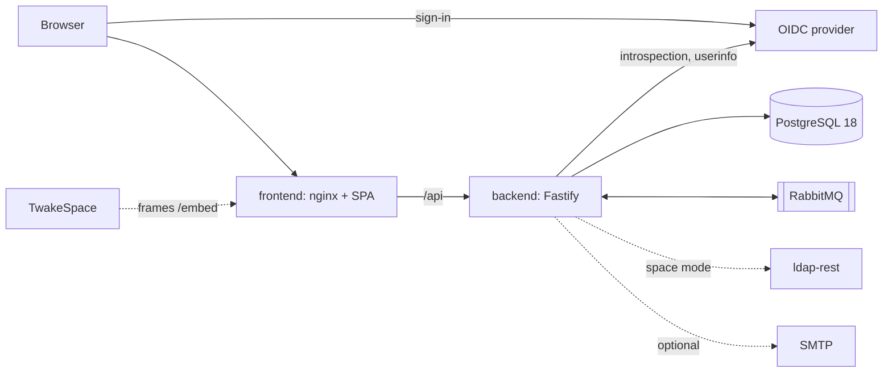

# Twake Project

Task management for Twake Workplace. The repository is `twake-tasks`; the app is called Twake Project in the interface, the registry (slug `project`) and the emails.



## What it needs

- PostgreSQL 18. The schema uses `uuidv7()`, and the backend runs its migrations at start. It refuses a superuser role, because a superuser skips the row level security that keeps organizations apart.
- RabbitMQ, in every mode. The backend consumes account deletions (`b2b` and `auth` exchanges) and settings updates from common settings (`settings` exchange), and publishes on the `activity` exchange. Its queue is a single active consumer, so several replicas handle events one at a time, in order.
- An OIDC provider (LemonLDAP in Twake Workplace) with two clients:
  - `twaketasks`, public, used by the browser. Its access tokens must carry the audience `twaketasks`.
  - `twaketasks-backend`, confidential, used by the backend to introspect tokens and read userinfo. Back-channel logout goes to `<APP_URL>/api/auth/backchannel-logout`.
  - Userinfo must hold `sub`, `sid`, `uuid` (the LDAP entryUUID) and `email`. `org_id` and `org_role` place the person in an organization; without `org_id` the person is a B2C user.
- SMTP, optional. Without `SMTP_URL`, notifications and board invitations stay in the app.
- ldap-rest, only in space mode.

## Modes

### Standalone (default)

`SPACE_INTEGRATION=false`. People create their own projects and share them by invitation. Each person gets a Personal project holding their Inbox. Nothing calls ldap-rest. RabbitMQ is still required: space events reaching the queue are acknowledged and ignored, and the outgoing activity events need no subscriber.

### Space mode

`SPACE_INTEGRATION=true`, with `LDAP_REST_URL` and `LDAP_REST_SECRET`. On top of the standalone features, each TwakeSpace space gets a managed project:

- The project and its members follow the `twake.space.*` events ldap-rest publishes on the `space` exchange. People cannot invite or remove members of a managed project by hand.
- When the backend knows no space yet, it sends `twake.space.sync.requested` at start, and ldap-rest answers with every space of every organization.
- Every night it repairs each space from the ldap-rest API, signing its requests with HMAC as `LDAP_REST_SERVICE_ID` (`twake-tasks` by default).
- Once a space has its project, it publishes `com.twake.tasks.space.provisioned.v1` on the `activity` exchange, which tells TwakeSpace the project to show for that space.

Turning space mode off leaves the managed projects in place.

### Embedded in TwakeSpace

TwakeSpace frames `/embed/projects/<projectId>` and an empty overlay page, `/embed/overlay.html`, which the app draws its dialogs into. The app reports its badges and metadata to TwakeSpace. To allow it:

- Set `CSP_FRAME_ANCESTORS` on the frontend to the TwakeSpace origin.
- The SSO must let the frontend frame it: the embed signs in silently in a hidden frame, and falls back to a popup when the SSO needs to show its portal.

### Platform top bar

With `workplaceFqdn` in `SSO_SCOPE`, the SSO names the person's Twake Workplace platform, and the app shows that platform's top bar, which exchanges the id token for a platform token. The platform must accept the app's SSO client for token exchange. Without the claim, the app shows its own header.

## Run it

You need Node 24 and Docker.

```bash
npm ci
docker compose up -d
cp apps/backend/.env.example apps/backend/.env
```

Compose starts PostgreSQL and RabbitMQ, and creates the `twake_tasks` role on a fresh volume. If your volume predates that role, recreate it with `docker compose down -v`.

Fill in `OIDC_CLIENT_SECRET` in `apps/backend/.env` (and the `LDAP_REST_*` settings for space mode), then put your SSO settings in `apps/frontend/public/.env.js`:

```js
var SSO_BASE_URL = 'https://sign-up.twake.app/'
var SSO_CLIENT_ID = 'twaketasks'
var SSO_SCOPE = 'openid email profile workplaceFqdn'
var SSO_REDIRECT_URI = 'http://localhost:3000/auth/callback'
var SSO_POST_LOGOUT_REDIRECT = 'http://localhost:3000/'
```

Start the backend and the frontend, and open http://localhost:3000. The dev server proxies `/api` to the backend on port 8080.

```bash
npm run dev -w @twake-tasks/backend
npm run dev -w @twake-tasks/frontend
```

## Configuration

### Backend

Read from the environment (from `apps/backend/.env` in dev). The backend refuses to start on an invalid value.

- `DATABASE_URL`, required.
- `RABBITMQ_URL`, required.
- `APP_URL`, required: the public URL of the frontend, used in the links of the emails.
- `OIDC_ISSUER` (https), `OIDC_CLIENT_SECRET`, required.
- `OIDC_CLIENT_ID` (`twaketasks-backend`), `OIDC_AUDIENCE` (`twaketasks`).
- `SPACE_INTEGRATION` (`false`). With `true`: `LDAP_REST_URL` and `LDAP_REST_SECRET` required, `LDAP_REST_SERVICE_ID` (`twake-tasks`).
- `SMTP_URL` (smtp or smtps), `MAIL_FROM`.
- `RABBITMQ_SPACE_EXCHANGE` (`space`), `RABBITMQ_B2B_EXCHANGE` (`b2b`), `RABBITMQ_AUTH_EXCHANGE` (`auth`), `RABBITMQ_SETTINGS_EXCHANGE` (`settings`), `RABBITMQ_ACTIVITY_EXCHANGE` (`activity`), `RABBITMQ_QUEUE` (`platform.all.twake-tasks`), `RABBITMQ_DEAD_LETTER_EXCHANGE` (`twake-tasks.dlx`), when the broker's names differ.
- `HTTP_HOST` (`0.0.0.0`), `HTTP_PORT` (`8080`), `LOG_LEVEL` (`info`).

Probes: `/health/live` and `/health/ready`.

### Frontend

The image writes `/.env.js` and its security headers from the container's environment at start. Its root filesystem can be read-only.

- `SSO_BASE_URL`, `SSO_CLIENT_ID`, `SSO_SCOPE`, `SSO_REDIRECT_URI`, `SSO_POST_LOGOUT_REDIRECT`, required: the app refuses to start without them.
- `API_UPSTREAM`: the backend's bare origin, which `/api` is proxied to. Without it `/api` answers 404. In Kubernetes, give the service's full name, since nginx ignores the search domains.
- `CSP_FRAME_ANCESTORS`: the hosts allowed to frame the embedded views (TwakeSpace).
- `CSP_IMG_SRC`: the hosts of people's pictures (Twake Workplace).
- `CSP_CONNECT_SRC`, `CSP_FRAME_SRC`: more sources, on top of the SSO and Sentry origins the image adds itself.
- `PERMISSIONS_POLICY`, to replace the default one.
- `SENTRY_DSN`, `SENTRY_ENVIRONMENT`, `SENTRY_FEEDBACK_ENABLED`: see below.

Probe: `/healthz`.

## Error reporting and feedback

- `SENTRY_DSN` turns Sentry on. The image adds the DSN's origin (not its key) to the `connect-src` of the CSP.
- `SENTRY_ENVIRONMENT` sets the environment of the events.
- `SENTRY_FEEDBACK_ENABLED=true` shows the feedback button in the app shell, once `SENTRY_DSN` is set. It is never shown on the embedded views.

Events carry the tag `app: twake-tasks` and the frontend version as release. They hold no user name or email; the feedback form has an optional email field, left empty. Feedback needs Sentry 24.4.2 or later. See [ADR 011](https://github.com/linagora/twake-space-architecture/blob/e7f0311227c4e6c3222e81fe77b1e69e869156bf/ADR011.md).

The feedback button comes from `@linagora/twake-feedback`. Drag it to move it: it snaps to the left or right edge, and the browser remembers where you left it. Without a mouse, `Shift+F10` (or the context menu key) on the button opens a menu to move it or reset its position. The form opens on the same side, in the language of the app.

## Publish it on the registry

Twake Project shows in the Twake Workplace home and bar as a standalone app (`"standalone": true` in the manifest). The registry archive ships no code: [manifest/manifest.webapp](manifest/manifest.webapp) and its icon are the whole archive. The home and the bar open the URL held by the `project.embedded-app-url` flag instead of a subdomain, so set that flag to the app's URL on each context.

Every frontend release (`frontend-v<version>` tag) publishes the archive on the dev channel of the registry as `<version>-dev.<commit>`, through [publish-manifest.yml](https://github.com/linagora/twake-workflows/blob/fffcd66cb995c51022cb1f985f934752b3bb0c5b/.github/workflows/publish-manifest.yml). The version comes from the tag and must equal the one in `apps/frontend/package.json`; the manifest carries none.

## Check it

Run `npm run check` before you push. It's what CI runs, and the backend tests need Docker (they start PostgreSQL and RabbitMQ with Testcontainers).

The end to end suite runs the images in space mode against a stub SSO:

```bash
./e2e/stack.sh up
npx playwright install chromium   # once, from e2e/
npm test -w @twake-tasks/e2e
./e2e/stack.sh down
```

The design of the app is in [ADR 009](https://github.com/linagora/twake-space-architecture/blob/3ed41a5067c6b22f307f01e2e0dbfc56d1aa11d9/ADR009.md), and embedding in TwakeSpace in [ADR 010](https://github.com/linagora/twake-space-architecture/blob/bbcb1ffe03e5452c99325662f247dadba8fecb7c/ADR010.md).
