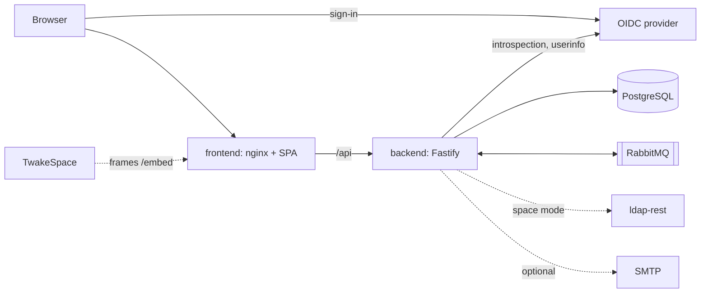

# Architecture

Twake Project is two images: a frontend (a React app served by nginx) and a backend (a Fastify API). The repository is `twake-tasks`; the app is called Twake Project in the interface, the registry (slug `project`) and the emails.

## Frontend

- nginx serves the built app and proxies `/api/` to the backend, so the browser talks to one origin.
- The browser signs in with the SSO itself and sends the access token to the backend as a bearer token.
- The settings (`/.env.js`) and the security headers are written from the container's environment at start. See [configuration](configuration.md#frontend).

## Backend

- Every API route is under `/api`. A request is authenticated by introspecting its token at the SSO and reading its userinfo.
- Board pages get live updates over server-sent events (`/api/boards/<id>/events`). A change made on any replica reaches every replica through PostgreSQL `LISTEN`/`NOTIFY`.
- Background work runs in the backend process, from a jobs table in PostgreSQL that every replica polls with `SKIP LOCKED`: reminders, notification and invitation emails, the purge of tasks 30 days after they go to the trash, and in space mode the nightly space repair.
- Outgoing events are written to an outbox table in the same transaction as the change, and relayed to RabbitMQ by one replica at a time (behind an advisory lock), in order.

## Organizations

- A person belongs to the organization named by the `org_id` claim of the SSO. People without one are B2C users.
- Every table has row level security, keyed on the organization. B2C rows have no organization, and a B2C user only sees the rows they have access to.
- The backend refuses to connect as a superuser, since a superuser skips row level security.

## Projects

- Each person gets a Personal project holding their Inbox.
- People create projects, and share them by invitation, with the roles viewer, editor and admin.
- In [space mode](modes.md#space-mode), each TwakeSpace space also gets a managed project, whose members come from the space.
