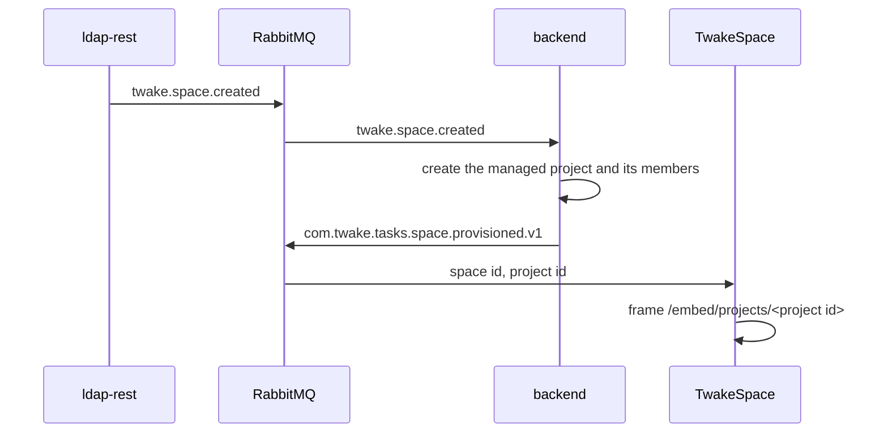

# Modes

The backend runs standalone or in space mode, set by `SPACE_INTEGRATION`. Embedding in TwakeSpace and the platform top bar are set on the frontend and the SSO, and work in either mode.

## Standalone

The default (`SPACE_INTEGRATION=false`).

- People create their own projects and share them by invitation.
- Nothing calls ldap-rest.
- RabbitMQ is still required. Space events that reach the queue are acknowledged and ignored, and the outgoing activity events need no subscriber.

## Space mode

`SPACE_INTEGRATION=true`, with `LDAP_REST_URL` and `LDAP_REST_SECRET`. On top of what standalone does, each TwakeSpace space gets a managed project.

- The project's name and members follow the `twake.space.*` events. People cannot invite or remove members of a managed project by hand.
- A member of a group linked to the space gets the group's role. A person in several gets their strongest role.
- When the backend knows no space yet, it sends `twake.space.sync.requested` at start, and ldap-rest answers with every space of every organization.
- Every night, the backend repairs each space from the ldap-rest API, one job per space, so one failing space retries alone.
- A deleted space's project is hidden at once and purged 30 days later.

Turning space mode off leaves the managed projects in place.

## Embedded in TwakeSpace

TwakeSpace frames two pages of the frontend:

- `/embed/projects/<project id>`: the boards of the project. A project with one board opens it directly.
- `/embed/overlay.html`: an empty page over TwakeSpace's whole window, which the app draws its dialogs and side panels into.

The app reports its badges and metadata to TwakeSpace, and keeps its navigation in step with TwakeSpace's history.

To allow it:

- Set `CSP_FRAME_ANCESTORS` on the frontend to the TwakeSpace origin. Only the embedded pages and the sign-in callback may be framed.
- The SSO must let the frontend frame it: the embed signs in silently in a hidden frame. When the SSO needs to show its portal, the embed opens it in a popup.

## Platform top bar

With `workplaceFqdn` in `SSO_SCOPE`, the SSO names the person's Twake Workplace platform, and the app shows that platform's top bar (home, the other apps, the account). The bar exchanges the id token for a platform token, so the platform must accept the app's SSO client for token exchange.

Without the claim, the app shows its own header. The embedded pages never show a bar.
